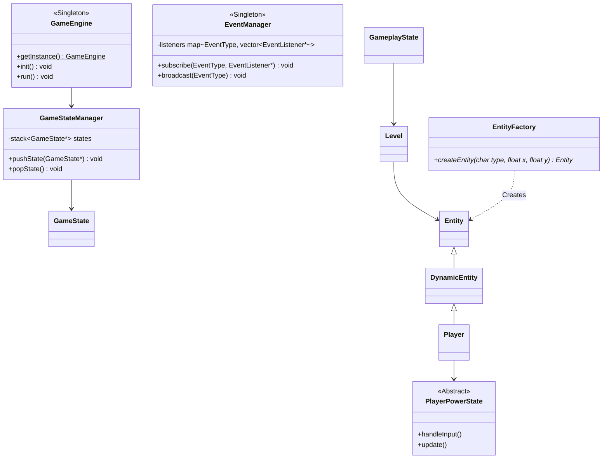
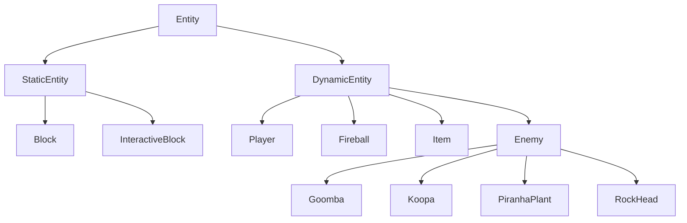

# Project Report: 2D Mario OOP C++ (Raylib) - Version 1.0

A high-performance, object-oriented 2D platformer game built in C++17 utilizing the Raylib media library. This document serves as the architectural report and technical specification concluding the first version of the game.

---

## 1. Executive Feature Summary

The first version of the game delivers a complete, playable gameplay loop, robust data handling, and custom engine systems.

### Core Features
*   **State-Stack Screen Architecture**: Game screens (menus, settings, gameplay, pauses) are overlayed dynamically, allowing game systems to freeze, overlay transparent layers, or restore state without destruction.
*   **Physics & Kinematics Engine**:
    *   **Independent Axis Motion**: Calculated using double-precision delta time. Accelerations and velocities on the horizontal ($X$) and vertical ($Y$) axes are independent to guarantee a crisp, muscle-memory feel.
    *   **Gravity & Terminal Velocity**: A customizable vertical acceleration caps at a `terminalVelocity` limit to prevent high-velocity clipping through solid block boundaries.
    *   **Double Jump**: Tracked via jumping state counters, allowing exactly one mid-air jump that resets when returning to solid ground.
*   **Fair-Play Collision Resolution**:
    *   **Predictive Look-Ahead Sweep**: Separately checks projected bounds for $X$ and $Y$ velocity steps. If an overlap is imminent, speed is zeroed out and coordinates are snapped to the boundary edge.
    *   **Stuck Recovery (MTV Solver)**: If platforms overlap an entity due to dynamic animations, a Minimum Translation Vector algorithm resolves the overlap by pushing the entity out along the shallowest axis.
    *   **Solid Filtering**: Temporarily disables collision between specified entities (e.g. items emerging from blocks, or piranha plants emerging through pipes).
*   **Asset Fallback System**: To prevent crash failures due to missing files, if `.png` textures or `.wav` sounds are not found in the `assets/` directory, the engine draws colored rectangles representing hitboxes and dynamically disables audio playback.
*   **User Persistence & Key Rebinding**: Serializes and loads user credentials, custom key configurations, levels unlocked, and high scores to text-based profiles inside the `accounts/` directory.

---

## 2. Design Patterns Implemented

The architecture leverages standard software design patterns to maintain low coupling and high cohesion across modules.



### 1. Singleton Pattern
Ensures single global control points for shared managers, preventing double-allocations or resource collisions:
*   **`GameEngine`**: Coordinates window lifespan, game loops, and default states.
*   **`AssetManager`**: Controls cache allocations for graphical textures.
*   **`SoundManager`**: Manages the OpenAL/WASAPI audio device context and music streams.
*   **`EventManager`**: Controls system-wide message dispatching.

### 2. State Pattern
Decouples state-specific updates, drawing, and transitions:
*   **System Screens (`GameState`)**: Managed via a `std::stack<GameState*>` inside `GameStateManager`. Allows screen overlays (like pausing over gameplay) where the lower state remains drawn but frozen.
*   **Player Powerups (`PlayerPowerState`)**: The `Player` delegates inputs, drawing sizes, and damage processing to concrete subclasses: `SmallState`, `SuperState` (doubles height, breaks bricks), and `FireState` (shoots bouncy fireballs).

### 3. Factory Method Pattern
*   **`EntityFactory`**: Evaluates char-based map layout matrices (e.g., `#` for ground blocks, `?` for item blocks, `G` for Goombas) to instantiate concrete entities at computed positions, keeping Level loading separate from Entity constructors.

### 4. Observer Pattern (Event System)
*   **`EventManager` & `EventListener`**: Allows entities to broadcast event messages (like `PlayerDied`, `CoinCollected`, `PointsEarned`). Subsystems like `SoundManager` and scoring scripts listen and respond to these events without directly referencing the player or enemy classes.

### 5. Strategy Pattern
*   **`AIBehaviorStrategy`**: Decouples intelligence updates from concrete `Enemy` classes. Subclasses implement specialized movement behavior (e.g., `PatrolStrategy` for standard walking Goombas, `SlamStrategy` for vertical dropping RockHeads).

---

## 3. Directory & File Structure

```text
1st_src/
├── CMakeLists.txt              # Build configuration & dependency fetch (Raylib 5.0)
├── main.cpp                     # Graphical game launcher entry point
├── test_mario.cpp               # Headless unit-testing suite
├── test.cpp                     # Diagnostic sanity check program
├── accounts/                    # Folder containing user credentials & scores
├── assets/                      # External game asset resources
└── src/
    ├── Core/                    # Core loop, input, graphics & sound managers
    ├── Entities/                # Base & concrete physical game objects
    ├── Persistence/             # Save/load file handlers for accounts
    ├── Physics/                 # Collision detection, camera, & kinematics
    ├── States/                  # Screen states (Menu, Gameplay, Pause, etc.)
    └── World/                   # Level loader and Entity grid factory
```

---

## 4. Class Hierarchies & Responsibilities

### Systems (`src/Core`, `src/Persistence`, `src/Physics`, `src/World`)

| Class Name | Directory | Primary Responsibility |
| :--- | :--- | :--- |
| **[GameEngine](file:///c:/Users/Admin/Desktop/Mario/1st_src/src/Core/GameEngine.h)** | `Core/` | Manages the main game loop, window lifecycles, and configuration parameters. |
| **[GameStateManager](file:///c:/Users/Admin/Desktop/Mario/1st_src/src/Core/GameStateManager.h)** | `Core/` | Manages the push/pop/transition logic of the `GameState` stack. |
| **[InputManager](file:///c:/Users/Admin/Desktop/Mario/1st_src/src/Core/InputManager.h)** | `Core/` | Maps keyboard bindings to virtual `Action` enums. Supports custom rebindings. |
| **[AssetManager](file:///c:/Users/Admin/Desktop/Mario/1st_src/src/Core/AssetManager.h)** | `Core/` | Loads, stores, and handles fallback logic for textures, preventing double-loads. |
| **[SoundManager](file:///c:/Users/Admin/Desktop/Mario/1st_src/src/Core/SoundManager.h)** | `Core/` | Initiates the audio device, handles background tracks (BGM), and plays sound effects (SFX). |
| **[EventManager](file:///c:/Users/Admin/Desktop/Mario/1st_src/src/Core/EventSystem.h)** | `Core/` | Decouples event dispatching. Maps `EventType` to registered `EventListener` pointers. |
| **[Account](file:///c:/Users/Admin/Desktop/Mario/1st_src/src/Persistence/Account.h)** | `Persistence/` | Data model containing username, hashed password, level progression, and settings. |
| **[SaveManager](file:///c:/Users/Admin/Desktop/Mario/1st_src/src/Persistence/SaveManager.h)** | `Persistence/` | Handles text stream serialization (`std::ofstream`/`std::ifstream`) to file paths. |
| **[GameCamera](file:///c:/Users/Admin/Desktop/Mario/1st_src/src/Physics/Camera.h)** | `Physics/` | Wraps Raylib's `Camera2D`. Centered on the player, clamped within level boundaries. |
| **[CollisionManager](file:///c:/Users/Admin/Desktop/Mario/1st_src/src/Physics/CollisionManager.h)** | `Physics/` | Runs axis-separated projection checks and Minimum Translation Vector recovery. |
| **[Level](file:///c:/Users/Admin/Desktop/Mario/1st_src/src/World/Level.h)** | `World/` | Manages level files, physics steps, drawing execution, and camera clamping. |
| **[EntityFactory](file:///c:/Users/Admin/Desktop/Mario/1st_src/src/World/EntityFactory.h)** | `World/` | Translates level characters (e.g. `M`, `F`, `G`) into entity objects. |

---

### Entities (`src/Entities`)



*   **[Entity](file:///c:/Users/Admin/Desktop/Mario/1st_src/src/Entities/Entity.h) (Abstract Base)**: Contains bounds (`position`, `spriteSize`, `hitboxSize`, `hitboxOffset`), active status, texture ID, and base virtual methods (`update`, `draw`, `onCollision`). Includes colored box debug rendering.
*   **[DynamicEntity](file:///c:/Users/Admin/Desktop/Mario/1st_src/src/Entities/DynamicEntity.h) (Base)**: Inherits from `Entity`. Adds physical attributes: `velocity`, `acceleration`, gravity, orientation (`facingRight`), and state flags (`onGround`).
*   **[Player](file:///c:/Users/Admin/Desktop/Mario/1st_src/src/Entities/Player.h)**: Handles score collections, player lives, keys, jumping physics, and power status delegation.
*   **[Fireball](file:///c:/Users/Admin/Desktop/Mario/1st_src/src/Entities/Fireball.h)**: A projectile that bounces on grounds and explodes on horizontal collisions.
*   **[Enemy](file:///c:/Users/Admin/Desktop/Mario/1st_src/src/Entities/Enemy.h) (Base)**: Inherits from `DynamicEntity`. Owns an `AIBehaviorStrategy` pointer to delegate movements:
    *   **[Goomba](file:///c:/Users/Admin/Desktop/Mario/1st_src/src/Entities/Goomba.h)**: Patrols horizontally. Dies (flattens) when jumped on from above.
    *   **[Koopa](file:///c:/Users/Admin/Desktop/Mario/1st_src/src/Entities/Koopa.h)**: Patrols horizontally. Retracts into a kicking shell on stomp.
    *   **[PiranhaPlant](file:///c:/Users/Admin/Desktop/Mario/1st_src/src/Entities/PiranhaPlant.h)**: Vertical emerging pipe-dweller. Immune to stomps.
    *   **[RockHead](file:///c:/Users/Admin/Desktop/Mario/1st_src/src/Entities/RockHead.h)**: Drops down vertically when player approaches, then slowly retracts.
*   **[StaticEntity](file:///c:/Users/Admin/Desktop/Mario/1st_src/src/Entities/StaticEntity.h) (Base)**: Inherits from `Entity`. Adds basic static block states:
    *   **[Block](file:///c:/Users/Admin/Desktop/Mario/1st_src/src/Entities/Block.h)**: Solid ground blocks.
    *   **[InteractiveBlock](file:///c:/Users/Admin/Desktop/Mario/1st_src/src/Entities/InteractiveBlock.h)**: Handles breakable bricks and question mark blocks that release coins or items.
*   **[Item](file:///c:/Users/Admin/Desktop/Mario/1st_src/src/Entities/Item.h)**: Represents collectibles (Mushroom, Fire Flower, Star, Coin).

---

### States (`src/States`)

*   **[MainMenuState](file:///c:/Users/Admin/Desktop/Mario/1st_src/src/States/MainMenuState.h)**: Handles Guest/Login/Register selections and general navigation.
*   **[LoginState](file:///c:/Users/Admin/Desktop/Mario/1st_src/src/States/LoginState.h) / [RegisterState](file:///c:/Users/Admin/Desktop/Mario/1st_src/src/States/RegisterState.h)**: Authenticates user credentials via `SaveManager`.
*   **[SettingsState](file:///c:/Users/Admin/Desktop/Mario/1st_src/src/States/SettingsState.h)**: Key rebindings panel. Updates `InputManager` and saves custom configurations to profiles.
*   **[LevelSelectState](file:///c:/Users/Admin/Desktop/Mario/1st_src/src/States/LevelSelectState.h)**: UI listing locked and unlocked levels with high scores.
*   **[GameplayState](file:///c:/Users/Admin/Desktop/Mario/1st_src/src/States/GameplayState.h)**: The main level loop. Spawns/updates entities, runs camera updates, and listens to event actions.
*   **[PauseState](file:///c:/Users/Admin/Desktop/Mario/1st_src/src/States/PauseState.h)**: Transparent overlay state that freezes physics updates but draws active gameplay under it.
*   **[GameOverState](file:///c:/Users/Admin/Desktop/Mario/1st_src/src/States/GameOverState.h)**: Displays score, final outcome, and handles restarting/exiting.

---

## 5. Development & Environment Notes

### Build Flow (CMake & Raylib)
The game uses a cross-platform CMake build configuration. It automatically fetches **Raylib 5.0** from source via CMake's `FetchContent` module, compiles it, and links it statically against the executable.

> [!NOTE]
> On CMake 4.0+ environments, configuring with `-DCMAKE_POLICY_VERSION_MINIMUM=3.5` is required to ensure compatibility with Raylib's nested configuration requirements.

### Windows execution and PATH resolution
When running the compiled binary `MarioGame.exe` in Windows environments:
*   **PowerShell DLL entry point errors (`0xC0000139` / `-1073741511`)**: This occurs if compiler runtimes (e.g. MSYS2 UCRT64 toolchain) clash with other compiler runtimes placed earlier in the Windows `PATH` (common culprits include `C:\Strawberry\c\bin` from Strawberry Perl). 
*   **The Fix**: Prepend the correct compiler bin path to the terminal session (`$env:PATH = "C:\msys64\ucrt64\bin;" + $env:PATH`), or copy `libstdc++-6.dll`, `libgcc_s_seh-1.dll`, and `libwinpthread-1.dll` from the compiler directory directly into the build folder alongside `MarioGame.exe` to make the binary portable.
